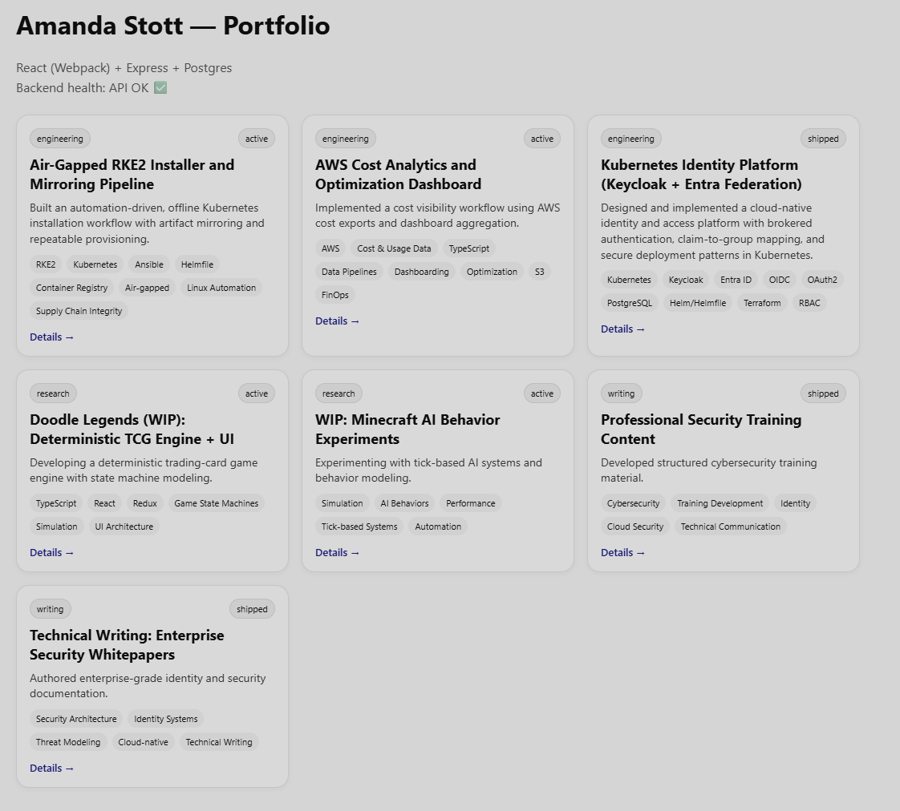

# folio

A TypeScript monorepo with a React + Webpack dev server app (`apps/web`) and an API proxy setup for local development.

## Requirements

- Node.js 20+ (recommended)
- npm 9+ (workspaces)
- (Optional) Docker for services you may add later

## Repo structure

```
folio/
├─ apps/
│  └─ web/
│     ├─ public/
│     │  └─ index.html
│     ├─ src/
│     │  └─ index.tsx
│     ├─ tsconfig.json
│     ├─ webpack.config.ts
│     └─ package.json
├─ package.json
├─ package-lock.json (optional)
└─ README.md
```

## Screenshot



> Notes:
> - `apps/web/webpack.config.ts` is authored as an **ES module** (uses `import ...`), so `require()` is not used.
> - `webpack.config.ts` narrows `mode` to valid webpack values (`development | production | none`) to keep TypeScript happy.

## Getting started

Install dependencies from the repo root:

```bash
npm install
```

## Running the web app (dev)

From the repo root:

```bash
npm run web:dev
```

This runs the `apps/web` workspace dev server (Webpack Dev Server) on:

- http://localhost:3000

### API proxy

The dev server proxies API requests to your backend:

- Requests starting with `/api` → `http://localhost:4000`

This is configured in `apps/web/webpack.config.ts` under `devServer.proxy`.

## Useful scripts

From the repo root (recommended):

```bash
npm -w web run dev
```

Or via the convenience script (if present in root `package.json`):

```bash
npm run web:dev
```

Common additions you may want:

- `npm -w web run build` (production bundle)
- `npm -w web run lint` (if/when you add linting)
- `npm -w web run test` (if/when you add tests)

## Webpack config highlights (apps/web)

- **Entry:** `./src/index.tsx`
- **Output:** `apps/web/dist/bundle.js`
- **Dev server:** port **3000**, HMR enabled, SPA routing (`historyApiFallback: true`)
- **TypeScript:** `ts-loader` using `apps/web/tsconfig.json`
- **HTML:** `html-webpack-plugin` using `./public/index.html`

## Troubleshooting

### “ReferenceError: require is not defined in ES module scope”
Your webpack config is being executed as ESM. Use `import` instead of `require`, and define `__dirname` via `import.meta.url` (already done in `apps/web/webpack.config.ts`).

### Webpack “mode” TypeScript error
Webpack expects `mode` to be one of `"development" | "production" | "none"`. If you derive it from `process.env.NODE_ENV`, narrow it to those values (already done).

---

## License

MIT
